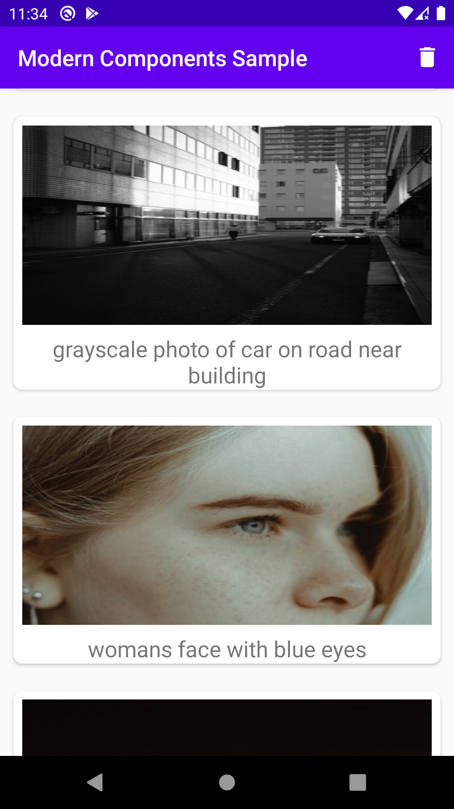
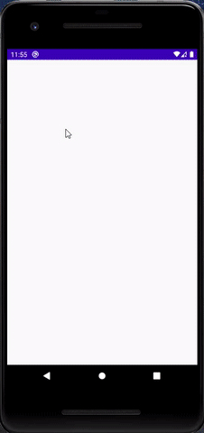

# Room_MVVM_RxJava_Retrofit
A sample with most popular libraries in MVVM with offline support. learn how to deploy popular components to eachother by simple sample in Java language.
This project uses <a href="Unsplash.com" > Unsplash.com </a> APIs.

 
 

<h3> Create Unsplash.com Acount</h3>

Please go to <a href="Unsplash.com" > Unsplash </a> and define a new app and then replace given Access Key to <mark>NetworkApi.java</mark> interface.

<h3> The app has following packages: </h3>
data: It contains all the data accessing and manipulating components.

view: Activity and Recycler Adapter class.

viewmodel: ViewModel class with Livedata.

#Dependencies and Libraries
*Room
*room-rxjava2
*lifecycle-viewmodel
*lifecycle-livedata
*lifecycle-reactivestreams
*Retrofit2
*Retrofit2 converter-gson
*Retrofit2 adapter-rxjava2

