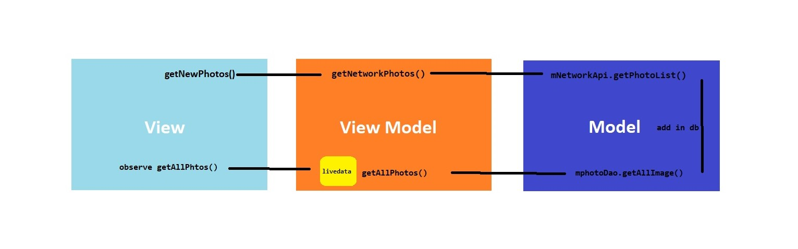

# Room_MVVM_RxJava_Retrofit
A sample with most popular libraries in MVVM with offline support. learn how to deploy popular components to eachother by simple sample in Java language.
This project uses <a href="Unsplash.com" > Unsplash.com </a> APIs.

 
 

<h3> Create Unsplash.com Acount</h3>

Please go to <a href="Unsplash.com" > Unsplash </a> and define a new app and then replace given Access Key to <mark>NetworkApi.java</mark> interface.

<h2> how it works? </h2>

 

